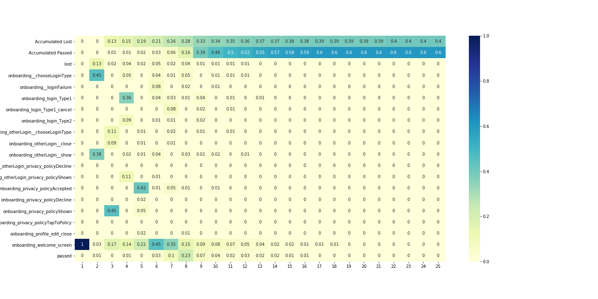
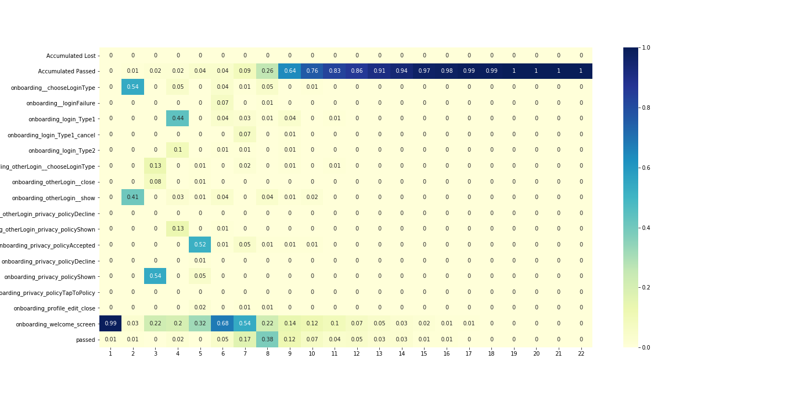
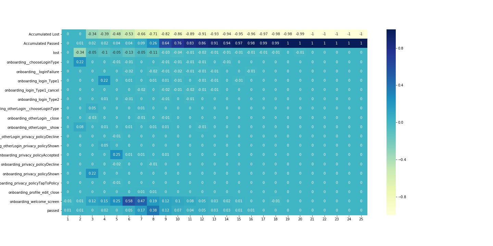
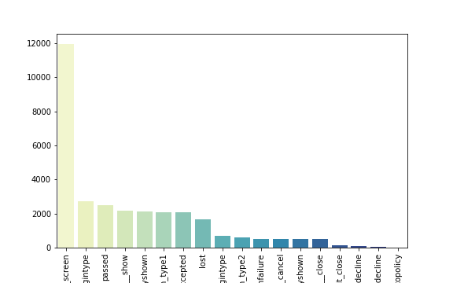
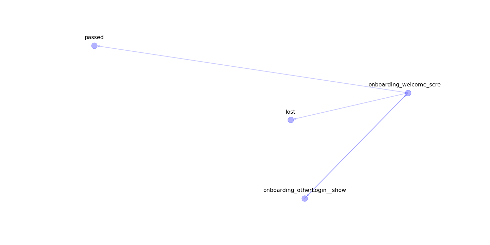

Analysis
========

Please, see the `data preparation tutorial <data_preparation.md>`__ for
understand how to prepare data for this functions.

Load data
---------

.. code:: python

    import pandas as pd
    df = pd.read_csv('example_datasets/train.csv')

First steps
-----------

In this tutorial, we will describe the onboarding lost-passed case.

**Goal**

Our goal is to detect interface elements/screens of an app at which
users' engagement drops significantly and induces them to leave the app
without account registration.

**Tasks**

1. Collect data
2. Prepare data
3. Analyze data

   1. Build pivot tables
   2. Visualize users path in the app
   3. Build the classifier

      1. Classifier helps you to pick out specific users paths
      2. Classifier allows estimating the probability of the user's
      leaving from the app based on his current path. One can use this
      information to dynamically change the content of the app to prevent that.

**Expected results**

1. You will identify the most "problematic" elements of the app
2. You will get the classifier which will allow you to predict the user's
leaving from the app based on the current user's behavior

Import retentioneering framework
~~~~~~~~~~~~~~~~~~~~~~~~~~~~~~~~

First of all, we need to import data and set documents config with the export folder
(you can leave it empty and the script will create a folder with current timestamp).

.. code:: python

    from retentioneering import analysis
    settings = {
        'export_folder': './experiments/new_experiment'
    }

Events\` probability dynamics
~~~~~~~~~~~~~~~~~~~~~~~~~~~~~

.. code:: python

    desc = analysis.get_desc_table(df,
                                   settings=settings,
                                   plot=True,
                                   target_event_list=['lost',
                                                      'passed'])

Each column of the table corresponds to a sequence number
   of the user's steps from the path and each row corresponds to event name.

Values of the table show the probability that the user choose the appropriate event at the appropriate step.

It's difficult to make a complex analysis from that table so it is better
   to split our users to those who leave the app and those who passed.

Difference in passed and lost users behaviour
~~~~~~~~~~~~~~~~~~~~~~~~~~~~~~~~~~~~~~~~~~~~~

.. code:: python

    # find users who get lost
    lost_users_list = df[df.event_name == 'lost'].user_pseudo_id.unique()

    # create filter for lost users
    filt = df.user_pseudo_id.isin(lost_users_list)

    # filter data for lost users trajectories
    df_lost = df[filt]

    # filter data for passed users trajectories
    df_passed = df[~filt]

Plot dynamics for different groups.

Plot for group of users who have **lost** event:

.. code:: python

    desc_loss = analysis.get_desc_table(df_lost,
                                        settings=settings,
                                        plot=True,
                                        target_event_list=['lost',
                                                           'passed'])

.. image:: ../_static/plots/desc_table_lost.png
   :width: 1200
   :alt: Probability dynamics for lost users

Plot for group of users who have **passed** event:

.. code:: python

    desc_loss = analysis.get_desc_table(df_passed,
                                        settings=settings,
                                        plot=True,
                                        target_event_list=['lost',
                                                           'passed'])

.. code:: python

    diff_df = analysis.get_diff(desc_loss,
                                desc_passed,
                                settings=settings,
                                precalc=True)

Agregates over user transitions
~~~~~~~~~~~~~~~~~~~~~~~~~~~~~~~

Lets aggregate our data over users transitions:

.. code:: python

    agg_list = ['trans_count', 'dt_mean', 'dt_median', 'dt_min', 'dt_max']
    df_agg = analysis.get_all_agg(df, agg_list)
    df_agg.head()

Out:

.. code-block:: none

                        event_name                      next_event  trans_count
    0  onboarding__chooseLoginType                            lost            1
    1  onboarding__chooseLoginType          onboarding_login_Type1          414
    2  onboarding__chooseLoginType          onboarding_login_Type2          159
    3  onboarding__chooseLoginType  onboarding_privacy_policyShown         2133
    4     onboarding__loginFailure                            lost            1

Now we can see which transitions take the most time and how often people have used different transitions.

We could choose the 10 longest users' paths:

.. code:: python

    df_agg.sort_values('trans_count', ascending=False).head(10)

Out:

.. code-block:: none

                               event_name                         next_event  trans_count
    84          onboarding_welcome_screen          onboarding_welcome_screen         5021
    85          onboarding_welcome_screen                             passed         2330
    3         onboarding__chooseLoginType     onboarding_privacy_policyShown         2133
    79          onboarding_welcome_screen        onboarding__chooseLoginType         1938
    67     onboarding_privacy_policyShown             onboarding_login_Type1         1675
    11             onboarding_login_Type1  onboarding_privacy_policyAccepted         1666
    82          onboarding_welcome_screen        onboarding_otherLogin__show         1601
    62  onboarding_privacy_policyAccepted          onboarding_welcome_screen         1189
    78          onboarding_welcome_screen                               lost         1043
    47        onboarding_otherLogin__show          onboarding_welcome_screen          876

You can see the events where users spend most of their time. It seems
reasonable to analyze only popular events to get stable results.

Adjacency matrix
~~~~~~~~~~~~~~~~

The adjacency matrix is the representation of the graph.
You can read more about it on the`wiki <https://en.wikipedia.org/wiki/Adjacency_matrix>`__:

.. code:: python

    adj_count = analysis.get_adjacency(df_agg, 'trans_count')
    adj_count

Out:

.. code-block:: none

                                          onboarding_login_Type1   onboarding_privacy_policyShown
    onboarding_login_Type1                                   0.0                              0.0
    onboarding_privacy_policyShown                        1675.0                              0.0
    onboarding__loginFailure                                 0.0                              0.0
    onboarding_privacy_policyTapToPolicy                     0.0                              0.0
    onboarding_welcome_screen                                0.0                              0.0

Users clustering
~~~~~~~~~~~~~~~~

Also, we could clusterize users by the frequency of events in their path:

.. code:: python

    countmap = analysis.utils.plot_frequency_map(df, settings, )

.. image:: ../_static/plots/countmap.png
   :width: 1200
   :alt: Heatmap of user trajectories

On that plot, we can see that some users have pretty close frequencies of different functions usage.

And we can see that it is useful to separate groups with different conversion rates:

.. code:: python

    analysis.utils.plot_clusters(df, countmap, n_clusters=5, plot_cnt=2)

.. image:: ../_static/plots/pie_cluster.png
   :width: 1200
   :alt: Distribution of target class in founded clusters

Graph visualization
~~~~~~~~~~~~~~~~~~~

We have two options to plot the graphs:
1. With python (this is local)
2. With our API
(``in that case, you'll send your data to our servers, but we don't save it and using only for visualization``)

In the second option, the plot looks much better and obvious.

.. code:: python

    analysis.utils.plot_graph_python(df_agg, 'trans_count', settings)

.. image:: ../_static/plots/graph_1.png
   :width: 1200
   :alt: Python graph visualization

.. code:: python

    from retentioneering.utils.export import plot_graph_api
    plot_graph_api(df_lost, settings)

Lost-Passed classifier
~~~~~~~~~~~~~~~~~~~~~~

Model fitting
^^^^^^^^^^^^^

.. code:: python

    clf = analysis.Model(df, target_event='lost', settings=settings)
    clf.fit_model()

.. image:: ../_static/plots/scores.png
   :width: 1200
   :alt: Model metrics

It returns metrics of quality of the model.

PUT HERE DESCRIPTION OF METRICS
===============================

Model inference
^^^^^^^^^^^^^^^

We have data for new users, who are not passed or lost already.

Lets load it into pandas DataFrame:

.. code:: python

    test_data = pd.read_csv('example_datasets/test.cdv')

Now we can predict probabilities for new users:

.. code:: python

    prediction = clf.infer(test_data)
    prediction.head()

Out:

.. code-block:: none

                         user_pseudo_id  not_target    target
    0  000bf8e1812a0335c7e65d52b3f6e816    0.976125  0.023875
    1  00275391998b3f87d798f6e7a1ec5c15    0.757970  0.242030
    2  004ecbe8a710f3c7b5b3cbc9bc0c74b2    0.727521  0.272479
    3  00530441b09d5494b09e936a97d5cb99    0.988654  0.011346
    4  005502038cec478faf343fe54310a848    0.592515  0.407485

Understanding your data
^^^^^^^^^^^^^^^^^^^^^^^

You can plot projection of users trajectories to understand how your data looks likes:

.. code:: python

    clf.plot_projections()

.. image:: ../_static/plots/tsne_classes.png
   :width: 1200
   :alt: Model metrics

Understanding prediction of your model
^^^^^^^^^^^^^^^^^^^^^^^^^^^^^^^^^^^^^^

Also, you can plot results of the model inference over that projections to understand the cases where your model fails:

.. code:: python

    clf.plot_projections(sample=data.event_name.values, ids=data.user_pseudo_id.values)

.. image:: ../_static/plots/tsne_probs.png
   :width: 1200
   :alt: Model metrics

Visualizing graph for area
^^^^^^^^^^^^^^^^^^^^^^^^^^

From the previous plot, you can be interested in what trajectories has high conversion rates.

You can select the area on that plot and visualize it as a graph:

.. code:: python

    # write coordinates bbox angles

    bbox = [
        [-4, -12],
        [8, -26]
    ]

    clf.plot_cluster_track(bbox)

The most important edges
^^^^^^^^^^^^^^^^^^^^^^^^

You could find what was the most important edges and nodes in your model for debugging
(e.g. it helps you to understand 'leaky' events) or to find problem transitions in your app.

Edges:

.. code:: python

    imp_tracks = clf.build_important_track()
    imp_tracks[imp_tracks[1].notnull()]

Out:

.. code-block:: none

                                 0                              1
    0  onboarding__chooselogintype         onboarding_login_type1
    1       onboarding_login_type1       onboarding__loginfailure
    2  onboarding__chooselogintype         onboarding_login_type2
    3       onboarding_login_type2    onboarding_otherlogin__show
    5     onboarding__loginfailure  onboarding_login_type1_cancel

Nodes:

.. code:: python

    imp_tracks[imp_tracks[1].isnull()][0].values

Out:

.. code-block:: none

    array(['onboarding__loginfailure', 'onboarding_login_type1',
           'onboarding_login_type1_cancel', 'onboarding_login_type2',
           'onboarding_otherlogin_privacy_policyshown',
           'onboarding_privacy_policydecline', 'onboarding_welcome_screen'],
          dtype=object)